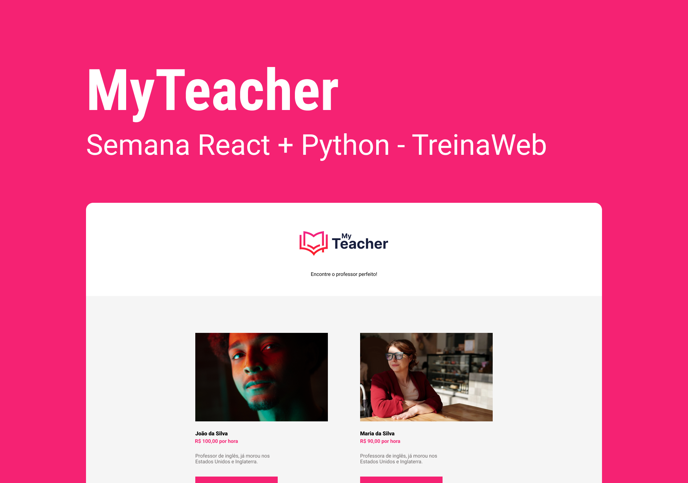

# MyTeacher - Semana React + Python, TreinaWeb

<div align="center">
    
</div>

## 🚀 Tecnologias

### Frontend
- [NextJS](https://nextjs.org), construído com [create-next-app](https://www.npmjs.com/package/create-next-app)
- [ReactJS](https://reactjs.org/)
- [Typescript](https://www.typescriptlang.org)
- [Node.js](https://nodejs.org/en/)
- [NPM](https://www.npmjs.com)

### Backend
- [Python](https://www.python.org)
- [Django](https://www.djangoproject.com)

---

## ⚙ Ferramentas e Dependências

### Frontend
- [Material-UI (MUI)](https://mui.com/pt/)

### Backend
- [Django REST Framework](https://www.django-rest-framework.org)
- [Django Cors Headers](https://pypi.org/project/django-cors-headers/)
---

## 💻 Projeto
O MyTeacher é uma plataforma onde um usuário pode marcar aulas com um professor listado. O MyTeacher foi desenvolvido durante a **Semana React + Python**, da **[Treinaweb](https://www.treinaweb.com.br)**

---

## 📑 Material Complementar
Você pode visualizar o [Notion](https://www.notion.so/pt-br) do [frontend](./frontend/) dessa aplicação por meio [desse link](https://treinaweb.notion.site/Semana-React-e-Python-Front-End-76045ad916c54cfcb43efc9c5c7c1f55).

E também, pode visualizar o [Notion](https://www.notion.so/pt-br) do [backend](./backend/) da aplicação por meio [desse link](https://treinaweb.notion.site/Semana-React-e-Python-Back-End-35dbb33ce6a64b7194175fa85463d1df).

---

## 🎨 Layout
Você pode visualizar o layout do projeto através [desse link](https://www.figma.com/file/Z5HZqvPWme3ta9UXy9w7xN/My-Teacher). É necessário possuir uma conta no [Figma](figma.com) para acessar e copiar o layout.

## 💻 Acesse o projeto local

### ✅ Requisitos
Antes de começar, você precisa ter o [Git](https://git-scm.com),o [Node](nodejs.org) e o [Python](https://www.python.org) instalados.

```bash
# 1º Passo - Clone o projeto
git clone https://github.com/Gustavo-Nasc/MyTeacher
```

#### Abrir o Frontend da aplicação
```bash
# 1º Passo - Abrir a pasta do frontend
cd frontend/

# 2º Passo - Instalar todas as dependências
npm install
# ou
yarn install

# 3º Passo - Iniciar o servidor
npm run dev
# ou
yarn dev

# O servidor será aberto na URL: http://localhost:3000
```

#### Abrir o Backend da aplicação
```bash
# 1º Passo - Abrir a pasta do backend
cd backend/

# 2º Passo - Criar a Virtualenv do Python
python -m venv .venv

# 3º Passo - Ativar a Virtualenv do Python
.\.venv\Scripts\activate

# 4º Passo - Instalar as dependências (Django, Django REST Framework e Django Cors Headers)
pip install django djangorestframework django-cors-headers

# 5º Passo - Iniciar o servidor
python manage.py runserver

# O servidor será aberto na URL: http://localhost:8000
```